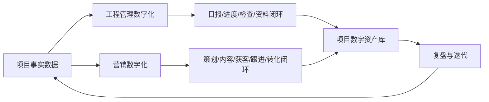
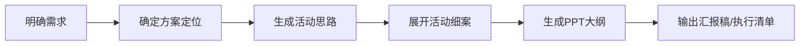
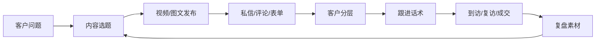

# 项目数字化策划书

> 适用对象：房地产开发/代建项目  
> 策划范围：工程管理数字化 + 营销数字化  
> 基础样本：鄠邑梧桐樾府工程管理自动化实践、地产营销AI提效公众号案例

## 1. 策划目标

本策划书不是单独采购一个系统，而是把项目一线已经形成的自动化能力，整理成可复制的数字化工作体系。

目标分为两条线：

| 方向 | 核心目标 | 主要产出 |
|------|----------|----------|
| 工程管理数字化 | 让资料、日报、检查、会议、整改闭环可追踪、可生成、可复用 | 项目数据底座、资料生成脚本、OCR识别、日报知识库、检查提醒、会议/专项检查方案 |
| 营销数字化 | 让策划、获客、客户跟进、视频内容和案场转化形成标准化工具链 | AI策划/PPT流程、客户跟进话术库、AI视频获客系统、素材库、内容日历、转化复盘 |

策划的最终状态是：工程侧把项目真实进度沉淀为数据，营销侧把客户问题和项目卖点转化为内容与线索，两端共用同一套项目事实、风险边界和内容资产。

## 2. 项目基础

工程侧样本来自 `huyu-project`，对应项目为西安鄠邑区梧桐樾府：

| 项目要素 | 内容 |
|----------|------|
| 项目类型 | 房地产代建项目 |
| 建筑规模 | 总建筑面积约 53508.44 平方米，含住宅、公共建筑及地下车库 |
| 管理特点 | 多楼栋、多参建单位、主体/基础/精装/室外多阶段并行 |
| 数字化基础 | 已有项目资料生成、OCR识别、施工日报、进度知识库、检查提醒、资料同步等脚本化能力 |

公开发布文档仅使用项目概况、角色分工和能力结构，不发布通讯录、手机号、个人隐私及内部文件原文。

## 3. 总体架构



数字化建设按四层推进：

| 层级 | 工程侧 | 营销侧 |
|------|--------|--------|
| 数据层 | 项目信息、楼栋进度、日报、检查标准、资料目录 | 客户问题、卖点素材、视频脚本、话术、线索、成交反馈 |
| 工具层 | OCR、文档生成、日报解析、检查提醒、资料同步 | AI策划、AI话术、AI视频、素材库、内容日历、CRM/飞书表格 |
| 流程层 | 日报输入 → 进度更新 → 风险识别 → 检查/会议 → 资料归档 | 需求洞察 → 内容生产 → 多平台发布 → 客户跟进 → 转化复盘 |
| 管理层 | 权限、版本、合规、考核、责任人 | 品牌口径、素材授权、客户隐私、线索归因、转化指标 |

## 4. 工程管理数字化方案

### 4.1 项目数据底座

建立一份项目主数据表，统一维护：

| 数据类别 | 主要字段 | 用途 |
|----------|----------|------|
| 项目基础信息 | 项目名称、代码、面积、投资、楼栋、许可证 | 文档自动填充、对外口径统一 |
| 参建单位 | 建设、代建、施工、监理、设计、勘察、第三方 | 会议、检查、资料责任归属 |
| 楼栋信息 | 楼号、层数、面积、当前阶段 | 进度看板、风险识别 |
| 资料体系 | 编号、文件名称、归属类别、更新状态 | 资料生成、整改闭环 |
| 检查标准 | 安全、质量、危大、双重预防 | 日报触发检查提醒 |

### 4.2 资料生成自动化

现有 `huyu-project` 已形成 `gen_01~gen_50` 文档生成体系，可作为工程资料自动化底座：

| 模块 | 范围 | 数字化动作 |
|------|------|------------|
| 管理制度体系 | `gen_01~25` | 根据项目基础信息生成安全生产、培训、危大、消防、应急等制度文件 |
| 安全管理行为 | `gen_26~41` | 生成安全检查、交底、教育、会议、台账、整改闭环资料 |
| 质量管理行为 | `gen_42~49` | 生成质量检查、过程控制、验收相关资料 |
| 施工日报 | `gen_50` | 将每日施工情况标准化为可追踪日报 |

建设建议：

1. 保留脚本生成能力，但把项目参数从脚本中抽出，形成 `project_master.json` 或电子表格。
2. 每次生成资料时保留版本号、生成时间、数据来源和责任人。
3. 资料输出目录按“制度文件、检查资料、会议资料、日报、整改闭环”统一归档。

### 4.3 OCR 与资料采集

现场图片、PDF、扫描件进入项目后，先进入 OCR 识别流程：


重点场景：

| 场景 | 输入 | 输出 |
|------|------|------|
| 施工日报图片 | 微信图片、截图、PDF | 标准日报文本 |
| 合规手续 | PDF证照、批复文件 | 证号、日期、范围、有效期 |
| 会议/检查资料 | 扫描件 | 检查问题、整改责任、闭合状态 |
| 通讯录/组织资料 | 图片或表格 | 角色结构和责任人，不公开个人隐私 |

### 4.4 日报驱动的进度与风险联动

工程侧最关键的闭环是“日报不是文档，而是触发器”。

| 输入 | 自动识别 | 自动输出 |
|------|----------|----------|
| 楼栋施工内容 | 主体、基础、砌体、精装、室外、防水等阶段 | 楼栋进度追踪 |
| 关键词 | 混凝土浇筑、满堂架拆除、爬架安装、塔吊、防水 | 安全/质量/危大检查提醒 |
| 人数与部位 | 劳动力变化、交叉作业情况 | 风险提示、资源趋势 |
| 当日关键节点 | 完成项、未完成项、异常项 | 周报/月报素材 |

落地流程：

1. 每日收集日报或现场图片。
2. OCR 或手工录入后写入施工进度知识库。
3. 自动更新楼栋进度表和当前施工阶段。
4. 根据阶段和关键词生成检查提醒。
5. 需要会议或专项检查时，自动生成议程、检查依据、参检人员和资料清单。
6. 检查完成后形成整改闭环资料，并同步到考核资料文件夹。

### 4.5 工程管理看板

建议建设一个轻量看板，而不是一开始做重型平台：

| 看板 | 关键指标 |
|------|----------|
| 项目总览 | 楼栋进度、当日人数、关键节点、风险数量 |
| 日报看板 | 日期、天气、施工部位、人数、完成情况、异常 |
| 风险看板 | 危大作业、检查提醒、整改状态、逾期项 |
| 资料看板 | 应有资料、已生成资料、待补资料、版本状态 |
| 会议检查看板 | 会议计划、专项检查、整改闭环、责任归属 |

## 5. 营销数字化方案

### 5.1 AI策划与PPT生成

适用场景：活动方案、渠道方案、案场节点包装、政策热点响应、周/月度汇报。

标准流程：



提示词结构：

| 模块 | 写法 |
|------|------|
| 角色 | 让 AI 扮演地产策划、案场经理、渠道负责人、短视频编导等 |
| 背景 | 项目区位、产品、客群、库存、价格、竞品、政策 |
| 目标 | 获客、邀约、到访、成交、品牌曝光、节点活动 |
| 约束 | 时间、预算、人员、物料、合规边界、平台限制 |
| 验收 | 输出表格、流程、物料清单、PPT结构、话术、KPI |

### 5.2 客户跟进与话术库

营销文章中反复出现的核心判断是：销售缺的不是客户，而是跟进客户的能力。

建议建立三类话术资产：

| 话术库 | 典型问题 | 输出形式 |
|--------|----------|----------|
| 异议处理 | 太贵了、再看看、考虑一下、清明不看房 | 分客户类型回复模板 |
| 逼单推进 | 多次到访不决策、临门一脚、竞品犹豫 | 递进式话术和动作清单 |
| 邀约复访 | 节假日邀约、政策节点、样板间开放 | 电话/微信/朋友圈文案 |

客户跟进流程：

1. 客户分层：新线索、首次到访、复访、强意向、犹豫、流失。
2. 跟进节奏：当天、3天、7天、14天、节点触发。
3. 话术匹配：按客户顾虑、预算、家庭角色、关注点生成。
4. 反馈记录：客户回复、下一步动作、转化状态。
5. 复盘优化：高转化话术沉淀，低转化话术淘汰。

### 5.3 AI视频获客系统

营销侧不能把“做视频”当目标，目标是获客。

AI视频获客系统分六步：

| 步骤 | 内容 | 工具/资产 |
|------|------|-----------|
| 1 | 明确目标客户和问题 | 客户问题库、竞品评论、案场反馈 |
| 2 | 拆解项目卖点 | 户型、采光、精装、园林、配套、价格、政策 |
| 3 | 生成脚本和钩子 | 前3秒钩子、口播稿、分镜脚本 |
| 4 | 生成视频素材 | 即梦、Seedance、豆包、剪映等合规工具 |
| 5 | 发布与分发 | 抖音、视频号、小红书、朋友圈、社群 |
| 6 | 线索跟进与复盘 | 私信、表单、电话、到访、成交归因 |

重点视频类型：

| 类型 | 示例 |
|------|------|
| 户型漫游 | 户型图转第一人称室内漫游 |
| 采光展示 | 日照变化、光影模拟、楼层对比 |
| 毛坯变精装 | 毛坯图/工地图生成精装效果 |
| 园林/配套漫步 | 效果图生成空间漫游 |
| 云看房 | 节假日或客户不到场时远程展示 |
| 探盘钩子 | 前3秒痛点、揭秘、利益、稀缺、情绪类钩子 |

### 5.4 素材库与内容日历

为避免每天临时想选题，需要建设“AI视频素材库”。

| 素材类型 | 采集方式 | 用途 |
|----------|----------|------|
| 项目素材 | 户型图、样板间、工地进度、园林效果图 | 视频生成、讲解图文 |
| 客户问题 | 案场问答、私信评论、到访顾虑 | 选题和话术 |
| 卖点素材 | 采光、精装、配套、政策、价格、交付 | 内容脚本 |
| 钩子素材 | 痛点、揭秘、利益、稀缺、情绪 | 前3秒标题 |
| 成交反馈 | 到访来源、客户关注点、成交原因 | 复盘优化 |

内容日历建议：

| 周期 | 内容重点 |
|------|----------|
| 周一 | 政策/市场热点解读 |
| 周二 | 户型/采光/空间展示 |
| 周三 | 客户问题答疑 |
| 周四 | 案场活动/节点邀约 |
| 周五 | 精装/配套/生活方式 |
| 周末 | 云看房、直播、复访转化 |

### 5.5 房产IP与转化

房产 IP 的关键不是“像机器一样高频发布”，而是要有真实问题、真实判断和真实服务。

转化闭环：



## 6. 工程与营销协同

工程管理数字化和营销数字化不能割裂。工程侧沉淀真实进度，营销侧把真实进度转化为可信内容。

| 工程数据 | 营销用法 |
|----------|----------|
| 楼栋进度 | 工程进度播报、准业主信心内容 |
| 精装节点 | 毛坯变精装、样板段展示 |
| 室外工程 | 园林、道路、口袋公园、交付场景视频 |
| 检查整改 | 品质管理、透明工地、安心交付 |
| 合规手续 | 项目信任背书 |
| 施工节点 | 周/月度项目播报、业主沟通素材 |

协同机制：

1. 工程每周输出“可公开项目进展素材包”。
2. 营销每周输出“客户问题清单和内容需求清单”。
3. 项目负责人审核可公开范围，避免发布敏感信息。
4. 内容发布后，客户反馈回流工程和案场。
5. 成交/到访数据反哺下一轮内容选题。

## 7. 实施路线图

### 第一阶段：0-30天，整理底座

| 任务 | 成果 |
|------|------|
| 梳理项目主数据 | 项目信息表、楼栋表、资料目录 |
| 清理资料脚本 | `gen_01~50` 脚本索引和参数表 |
| 统一营销案例 | 卖点库、客户问题库、话术库初版 |
| 建立发布规则 | 可公开/不可公开素材边界 |

### 第二阶段：31-60天，形成闭环

| 任务 | 成果 |
|------|------|
| 日报标准化 | 日报录入模板、进度自动更新 |
| 检查提醒自动化 | 风险关键词和检查事项映射 |
| AI策划流程上线 | 活动方案、PPT、执行表模板 |
| 视频素材库上线 | 户型、采光、精装、园林、钩子库 |

### 第三阶段：61-90天，看板和复盘

| 任务 | 成果 |
|------|------|
| 工程看板 | 进度、风险、资料、整改看板 |
| 营销看板 | 内容发布、线索、到访、转化看板 |
| 周会机制 | 工程-营销协同周会 |
| 复盘机制 | 内容效果、客户问题、项目进度联动复盘 |

### 第四阶段：90天后，产品化

| 任务 | 成果 |
|------|------|
| 参数化脚本 | 多项目复用 |
| 模板市场 | 工程资料模板、营销提示词模板 |
| 自动分发 | 多平台内容分发和数据回收 |
| 知识库沉淀 | 项目级数字资产库 |

## 8. 组织分工

| 角色 | 职责 |
|------|------|
| 项目负责人 | 数字化目标、公开边界、跨部门协调 |
| 工程负责人 | 日报、进度、检查、资料真实性 |
| 资料员/综合管理员 | 资料归档、模板维护、版本管理 |
| 营销负责人 | 客户问题、内容选题、线索转化 |
| 策划/内容人员 | AI策划、视频脚本、素材库运营 |
| 数字化管理员 | 脚本、看板、数据结构、权限配置 |

## 9. 指标体系

### 工程管理指标

| 指标 | 目标 |
|------|------|
| 日报结构化率 | 90%以上 |
| 资料自动生成率 | 70%以上 |
| 检查提醒覆盖率 | 覆盖主体、基础、精装、室外、危大重点场景 |
| 整改闭环及时率 | 按项目制度设定 |
| 资料查找时间 | 降低50%以上 |

### 营销数字化指标

| 指标 | 目标 |
|------|------|
| 内容选题储备 | 至少90天不重复 |
| 视频生产效率 | 单条脚本和素材准备时间降低50%以上 |
| 客户跟进记录完整率 | 90%以上 |
| 高意向客户二次触达率 | 80%以上 |
| 内容到访归因 | 可追踪主要平台和关键内容 |

## 10. 风险与合规

| 风险 | 控制方式 |
|------|----------|
| 个人信息泄露 | 公开文档不发布手机号、身份证、住址、完整通讯录 |
| 项目信息误发 | 建立可公开素材审核清单 |
| AI生成不准确 | 工程资料和营销承诺均需人工审核 |
| 视频素材侵权 | 只使用自有、授权或可商用素材 |
| 客户隐私泄露 | 客户案例脱敏，线索数据分级授权 |
| 过度承诺 | 营销内容不得承诺未确认交付、价格、政策 |

## 11. 首批可落地产物

| 编号 | 产物 | 说明 |
|------|------|------|
| D-01 | 项目主数据表 | 项目基本信息、楼栋、参建单位、资料目录 |
| D-02 | 工程日报模板 | 支持 OCR/手填/表格导入 |
| D-03 | 检查提醒规则表 | 施工阶段和风险关键词映射 |
| D-04 | 工程资料生成索引 | `gen_01~50` 资料清单 |
| M-01 | AI活动策划提示词 | 从需求到PPT的标准链路 |
| M-02 | 客户异议话术库 | “太贵了”“考虑一下”“再看看”等 |
| M-03 | AI视频获客脚本库 | 户型、采光、精装、云看房、探盘钩子 |
| M-04 | 内容日历 | 90天选题池和发布节奏 |
| M-05 | 工程进度营销素材包 | 每周从工程侧提炼可公开素材 |

## 12. 落地产物获取位置

本策划书及配套清单已发布到 GitHub 大仓，后续更新以仓库 `main` 分支为准。

| 类型 | 位置 |
|------|------|
| GitHub 大仓 | `https://github.com/whb786200/whb786200` |
| 策划书目录 | `https://github.com/whb786200/whb786200/tree/main/digitalization-plan` |
| 在线阅读 | `https://github.com/whb786200/whb786200/blob/main/digitalization-plan/README.md` |
| 营销工具清单 | `https://github.com/whb786200/whb786200/blob/main/digitalization-plan/marketing-toolkit.md` |
| 案例证据索引 | `https://github.com/whb786200/whb786200/blob/main/digitalization-plan/source-evidence.md` |

如需拉取到本地使用，执行：

```bash
git clone https://github.com/whb786200/whb786200.git
cd whb786200/digitalization-plan
```

如不使用 Git，也可下载 ZIP：

```text
https://github.com/whb786200/whb786200/archive/refs/heads/main.zip
```

当前本机落地位置：

| 产物 | 本地路径 |
|------|----------|
| Git 工作副本 | `D:\Codex\projects\数字化\whb786200-git` |
| 策划书 Markdown | `D:\Codex\projects\数字化\whb786200-git\digitalization-plan\README.md` |
| Word 文档 | `D:\Users\19586\Desktop\项目数字化策划书.docx` |

建议使用方式：

1. 对外阅读和协作，以 GitHub 的 `digitalization-plan` 目录为准。
2. 内部汇报和编辑，使用桌面 Word 文档。
3. 后续更新先修改 Markdown，再重新导出 Word，避免多版本散落。

## 13. 结论

这个项目的数字化不应只停留在“工程资料自动化”，也不应只停留在“营销短视频提效”。

真正有价值的做法是把工程侧真实、连续、可验证的数据，变成营销侧可信、可传播、可转化的内容资产；再把营销侧客户反馈，反向驱动工程展示、案场沟通和项目管理改进。

一句话概括：

> 工程数字化解决“项目如何被真实管理”，营销数字化解决“项目价值如何被客户看见”。
